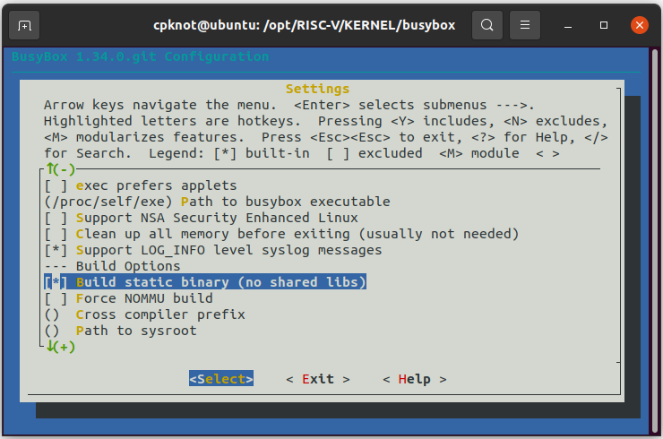
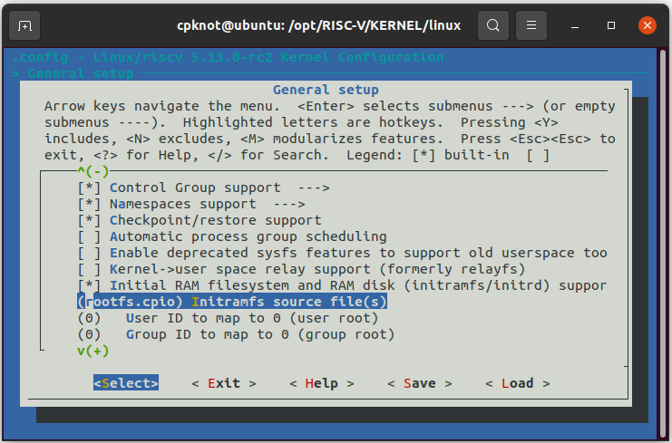
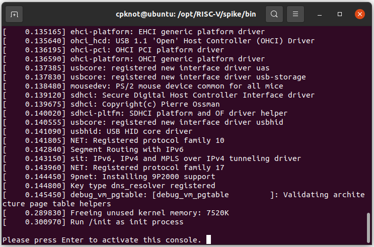

# Running boot Linux on Spike

Tutorial for build the Linux Kernel with Busybox, and running into Spike simulator.

# Prerequisites

Build the RISC-V cross-compiler, with the Linux mode:
```
git clone --recursive https://github.com/riscv/riscv-gnu-toolchain
cd riscv-gnu-toolchain
./configure --prefix=$RISCV --enable-multilib
make linux -j`nproc`
```

# Build Busybox

Frist, download the Busybox:  
```
git clone https://git.busybox.net/busybox
cd busybox
```

Next, we need create a custon config, for this use ```menuconfig```. Inside of config screan, enable the ```Build static binary (no shared libs)```, like a image below.
```
make ARCH=riscv CROSS_COMPILE=riscv64-unknown-linux-gnu- menuconfig
```


After that, just make the config.
```
make ARCH=riscv CROSS_COMPILE=riscv64-unknown-linux-gnu- -j`nproc`
make ARCH=riscv CROSS_COMPILE=riscv64-unknown-linux-gnu- install -j`nproc`
cd ..
```

In the end, it is expected to have the ```busybox```(~2MB) file in the project's root folder.


# Creating root path

First we'll creating a path, and sub-paths, them using for root into this project.

```
mkdir root && cd root
mkdir -p bin etc etc/init.d dev lib proc opt sbin sys tmp usr usr/bin usr/lib usr/sbin

```
We'll need a script ```rcS``` for initialisation.
```
vim etc/init.d/rcS
```

Inside this script, adding all synbolic link for initialisation.

OBS: All standard Linux commands are within the ``` busybox``` file, so to access them, we need to use busybox before the command. To eliminate this, it is necessary to add symbolic links, such as ```ln -s /bin/busybox /bin/ls```.
```
#!/bin/sh
busybox ln -s /bin/busybox /bin/ln

ln -s /bin/busybox /bin/mount
ln -s /bin/busybox /bin/ls
ln -s /bin/busybox /bin/mknod
ln -s /bin/busybox /bin/chmod

mount -t proc none /proc
mount -t sysfs none /sys

mknod /dev/null c 1 3
chmod 666 /dev/null

ln -s /dev/null /dev/tty2
ln -s /dev/null /dev/tty3
ln -s /dev/null /dev/tty4
```

After saving the script, we must copy the ```busybox``` file into the ```bin``` path and generate the symbolic link to the ```init``` file.

OBS: In this part, you can copy all data them you want to inside the ```root``` path. 
```
cp /copy/you/want/to opt/name

cp /path/to/busybox/busybox bin/busybox
ln -s ../bin/busybox sbin/init
ln -s sbin/init init
cd bin/
ln -s busybox sh
cd ..
sudo mknod dev/console c 5 1
```


Them , we must combine the ```root```path, into a single file.
```
find . | cpio --quiet -o -H newc > ../rootfs.cpio
cd .. 
```


# Build Linux image

To get the latest Linux kernel, follow this step:
```
git clone https://github.com/torvalds/linux.git
```

Then, we need copy the ```rootfs.cpio``` file into Linux kernel diretory.
```
cp rootfs.cpio linux/rootfs.cpio
cd linux
```

Like a Busybox, we need create a custon config. Inside of config screan, in  the ```Initial RAM filesystem and RAM disk (initramfs/initrd) support``` option, we must link ```rootfs.cpio``` file, like a image below.
```
make ARCH=riscv CROSS_COMPILE=riscv64-unknown-linux-gnu- menuconfig
```


After the previous configurations are completed, we need compile the Linux kernel with ```vmlinux```.
```
make ARCH=riscv CROSS_COMPILE=riscv64-unknown-linux-gnu- -j`nproc` vmlinux
```

After compilation, we will see ```vmlinux``` file in the current directory.


# Build Boot Loader

Download the Proxy Kernel and Boot Loader from [riscv-pk](https://github.com/riscv/riscv-pk) repo:
```
git clone https://github.com/riscv/riscv-pk.git
mkdir riscv-pk/build && cd riscv-pk/build
```

Compile and make the pk and bbl with Linux Kernel image we generated.
```
../configure --prefix=$RISCV \
--host=riscv64-unknown-linux-gnu \
--with-payload=/path/to/Linux/Kernel/vmlinux
make -j`nproc`
make install
```


# Running the Kernel 

Download the Spike simulator from [riscv-isa-sim](https://github.com/riscv/riscv-isa-sim.git) repo:

```
git clone https://github.com/riscv/riscv-isa-sim.git
mkdir riscv-isa-sim/build && cd riscv-isa-sim/build
```


Compile and make the Spike.
```
../configure --prefix=$RISCV 
make -j`nproc`
make install
```

For running spike, we must use bbl.
```
spike bbl
```

After all process we must see a message to start the console of our linux, like a image below:




